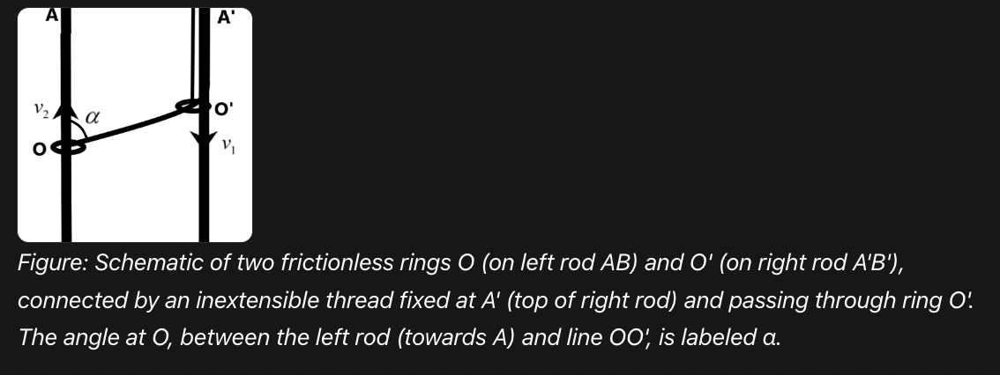

# Can Generative AI solve hard physics problems?

- This is a blog on using GenAI for solving physics problems. 

- For the [egg breaking problem](egg_throw.md), ChatGPT and Gemini made mistakes saying that _eggs will not break if thrown onto water_.

- For the [egg breaking problem](egg_throw.md), ChatGPT and Gemini made other omissions like not mentioning that freezing the egg (very low temperatures) would help it not crack.

- when probed further using the prompt _would an egg crack if it's thrown from a third-story building onto water?_ here is what ChatGPT answered:

Short answer: **very likely yes, it would crack**.

Here is why, in a physically grounded way:

### 1. Impact speed from a third story

A third-story height is roughly 8–12 meters. Ignoring air resistance, the egg hits the water at about:
[
v \approx \sqrt{2gh} \approx 12\text{–}15 ,\text{m/s}
]
That’s around 25–35 mph.

### 2. Water behaves “hard” at high speed

Although water feels soft at low speeds, at high impact speeds it behaves much more like a solid surface. This is because:

* The egg has to push water out of the way very quickly
* Water resists rapid deformation (inertia + viscosity effects)

This leads to a large deceleration force over a very short time.

### 3. Eggshell strength is limited

Eggshells are:

* Strong under **uniform compression** (e.g., squeezing evenly)
* Weak under **localized impact or bending stress**

Hitting water at speed creates:

* A sharp pressure spike on one side of the shell
* Uneven stress → cracking


- When might it *not* crack?

It’s possible (but unlikely) if:

* The egg enters **perfectly vertically (tip-first)**
* It hits **very calm water**
* The drop height is on the lower end
* The egg is unusually strong

Even then, it’s a borderline case.

---

- Bottom line

- From a third story, water is effectively “hard enough” that an egg will **almost certainly crack on impact**.


- model the actual **force on the egg vs. shell strength**—it’s a nice compact physics derivation and connects to fluid impact theory.

### Further modelling

- I then gave the following prompt _model the actual force on the egg vs. shell strength_

- This is what ChatGPT answered:

Let us take a typical chicken egg:

* mass (m \approx 0.06\ \text{kg})
* third-story height (h \approx 9\text{–}12\ \text{m})

Ignoring air resistance, the speed on impact is

[
v=\sqrt{2gh}\approx \sqrt{2(9.8)(9\text{–}12)} \approx 13\text{–}15\ \text{m/s}.
]

Now the key issue is: how quickly does the water stop the egg?

If the egg is brought to rest over a distance (d), then the average stopping force is roughly

[
F_{\text{avg}} \approx \frac{mv^2}{2d}.
]

Using (m=0.06\ \text{kg}) and (v \approx 14\ \text{m/s}):

* if (d = 1\ \text{cm} = 0.01\ \text{m}),

[
F_{\text{avg}} \approx \frac{0.06\cdot 14^2}{2(0.01)} \approx 590\ \text{N}
]

* if (d = 2\ \text{cm}),

[
F_{\text{avg}} \approx 295\ \text{N}
]

* if (d = 5\ \text{cm}),

[
F_{\text{avg}} \approx 118\ \text{N}
]

A second estimate comes from drag:

[
F_d \approx \tfrac12 \rho C_d A v^2
]

with water density (\rho \approx 1000\ \text{kg/m}^3), egg cross-sectional area (A \approx 1.5\times 10^{-3}\ \text{m}^2), and (C_d \sim 0.8\text{–}1). That gives

[
F_d \approx 100\text{–}180\ \text{N}
]

right at impact.

For comparison, a chicken egg typically fractures under loads of only **tens of newtons** in ordinary compression, though the exact number depends a lot on orientation and shell defects.

So the comparison is:

* **impact force from a third-story fall onto water:** roughly (100\text{–}600\ \text{N}), depending on how abruptly it stops
* **shell fracture load:** roughly (30\text{–}80\ \text{N}) for a typical egg, order of magnitude

That means the impact force is very plausibly several times larger than the shell can tolerate.

So the physical answer is: **yes, it would very likely crack**.

The important subtlety is that there is no single “actual force” here — the force rises and falls during impact, so what matters is the **peak force** and the **impact duration**, not just one number. The numbers above show why water does not necessarily protect the egg much at that speed.

- Plot of impact height vs. fracture load made using [python script](code/egg_crack_water_plot.py)


### Analysis for sand

Forthcoming

## Mathematics problem(s)

Forthcoming

## Irodov problem(s)

Image analysis (forthcoming)

I asked ChatGPT to solve a problem from the book Irodov (Figure 1).

- [Irodov book](https://dn710308.ca.archive.org/0/items/IrodovProblemsInGeneralPhysics/Irodov-Problems_in_General_Physics.pdf)

- [Krotov book](https://ia601408.us.archive.org/0/items/ProblemsInPhysicsSSKrotov/Problems%20In%20Physics%20SS%20Krotov.pdf)

- Small ball thrown at an initial velocity vo at an angle $\alpha$ to the horizontal strikes a vertical wall moving towards it at a horizontal velocity v and is bounced to the point from which it was thrown. Determine the time t from the beginning of motion to the moment of impact, neglecting friction losses.

## Solution by ChatGPT

Little projectile + moving-wall.  I will assume:

* the ball is thrown from the origin at (t=0) with (v_0) at angle (\alpha) (so (u_x=v_0\cos\alpha,;u_y=v_0\sin\alpha));
* the vertical acceleration is ( -g);
* the wall is a plane perpendicular to the (x)-axis, initially at (x=D) and moving toward the origin with speed (v) (so wall velocity (=-v));
* the collision is perfectly elastic and instantaneous (no change to vertical component at impact).

Let (t) be the time from launch to impact.  The collision position satisfies
[
x_{\text{ball}}(t)=u_x t,\qquad x_{\text{wall}}(t)=D - v t,
]
so
[
u_x t = D - v t \quad\Rightarrow\quad (u_x+v)t = D. \tag{1}
]

In the wall frame the horizontal velocity of the ball before impact is (u_x+v); an elastic bounce reverses that horizontal component, so transforming back to the lab frame the horizontal velocity immediately after impact is
[
v_x' = -\big(u_x+2v\big).
]
Thus the time from impact until the ball returns to the origin (horizontal condition (x_{\text{collision}}+v_x' t_r=0)) is
[
t_r=\frac{u_x t}{u_x+2v}. \tag{2}
]

Vertical motion is unaffected by the collision.  Let the collision height be
[
y_c = u_y t-\tfrac12 g t^2,
]
and the vertical velocity just after collision (v_{y,c}=u_y-gt).  Requiring the ball to return to (y=0) after time (t_r) gives
[
0 = y_c + v_{y,c}t_r -\tfrac12 g t_r^2.
]
This simplifies (collecting terms) to
[
u_y(t+t_r) - \tfrac12 g (t+t_r)^2 = 0
\quad\Rightarrow\quad t+t_r=\frac{2u_y}{g}. \tag{3}
]

Substitute (t_r) from (2) into (3):
[
t + \frac{u_x t}{u_x+2v} = \frac{2u_y}{g}.
]
Solve for (t).  Noting (1+\dfrac{u_x}{u_x+2v}=\dfrac{2(u_x+v)}{u_x+2v}) we get
[
t\frac{2(u_x+v)}{u_x+2v}=\frac{2u_y}{g}
\quad\Rightarrow\quad
t=\frac{u_y}{g},\frac{u_x+2v}{u_x+v}.
]

Finally substitute (u_x=v_0\cos\alpha,;u_y=v_0\sin\alpha):
[
\boxed{ ; t ;=; \frac{v_0\sin\alpha}{g},\frac{v_0\cos\alpha+2v}{,v_0\cos\alpha+v,};. }
]

(Checks: for (v=0) this gives (t=v_0\sin\alpha/g) — the half flight time as expected; the formula requires (v_0\cos\alpha+v\neq0).)


## Proof by Lean

Unverified

- [Lean file](code/projectile_irodov_figure1.lean)


## Another problem in Krotov

- _Problem 1.19_ Two rings O and O' are put on two vertical stationary rods AB and A'B' respectively. An inextensible thread is fixed at point A' and on ring O and is passed through ring O' (Fig. 6). Assuming that ring O' moves downwards at a constant velocity v1, determine the velocity v2 of ring O if  angle AOO' = alpha.

- 🤔 ❓ ChatGPT got this wrong initially and had to asked to recheck its answer. _But it got the general idea: that the length of thread remains constant and constrains the velocities of the rings_

- It gets "stuck" solving a physics problem
>     it "knows" it needs to apply a principle (conservation of momentum, etc).
>      gets the "big picture"
>      but then gets lost in the details

- ChatGPT DeepResearch got it right. It also provided an image (see below). I also asked it structure its answer according to the [prompt here](https://github.com/no-way-labs/residue/blob/main/prompt/residue.md)




- Gemini gave the following answer:

This problem is a classic application of **constrained motion** in kinematics. The key is to recognize that the total length of the inextensible thread remains constant, which relates the velocities of the two rings.

### 1. Define the Geometry and Coordinates
Let's set up a coordinate system where:
* The vertical positions of rings $O$ and $O'$ are measured downwards from the ceiling level ($AA'$). Let these be $y_2$ and $y_1$ respectively.
* The horizontal distance between the two rods is constant, let's call it $d$.
* The total length of the thread is $L$.

From the problem description, the thread starts at fixed point $A'$, passes through ring $O'$, and ends at ring $O$. Thus, the total length $L$ is composed of two segments:
1.  **Segment $A'O'$**: Its length is simply the vertical distance from the ceiling to ring $O'$, which is $y_1$.
2.  **Segment $O'O$**: Its length, let's call it $s$, is the distance between the two rings. Using the Pythagorean theorem:
    $$s = \sqrt{d^2 + (y_2 - y_1)^2}$$

The total length is:
$$L = y_1 + \sqrt{d^2 + (y_2 - y_1)^2}$$

### 2. Relate the Geometry to Angle $\alpha$
According to the diagram, $\alpha$ is the angle $\angle AOO'$. Since rod $AB$ is vertical, the vertical distance between the rings is the adjacent side to this angle in the right triangle formed by the horizontal distance $d$.
$$\cos \alpha = \frac{y_2 - y_1}{s}$$

### 3. Differentiate with Respect to Time
Since the thread is inextensible, its total length $L$ is constant, so $\frac{dL}{dt} = 0$.
Differentiating the length equation:
$$0 = \frac{dy_1}{dt} + \frac{d}{dt} \left( \sqrt{d^2 + (y_2 - y_1)^2} \right)$$
$$0 = v_1 + \frac{1}{2\sqrt{d^2 + (y_2 - y_1)^2}} \cdot 2(y_2 - y_1) \cdot \left( \frac{dy_2}{dt} - \frac{dy_1}{dt} \right)$$

We know that $\frac{dy_1}{dt} = v_1$ (velocity of $O'$) and $\frac{dy_2}{dt} = v_2$ (velocity of $O$). Substituting these and the expression for $\cos \alpha$:
$$0 = v_1 + \cos \alpha \cdot (v_2 - v_1)$$

### 4. Solve for $v_2$
Now, we rearrange the equation to find the velocity of ring $O$:
$$v_1 + v_2 \cos \alpha - v_1 \cos \alpha = 0$$
$$v_2 \cos \alpha = v_1 \cos \alpha - v_1$$
$$v_2 = \frac{v_1(\cos \alpha - 1)}{\cos \alpha}$$
$$v_2 = v_1 \left(1 - \frac{1}{\cos \alpha}\right)$$

---

### Final Answer
The velocity $v_2$ of ring $O$ is:
$$v_2 = v_1 (1 - \sec \alpha)$$

**Note on Direction:**
Since $\alpha$ is an acute angle, $\sec \alpha > 1$, making $v_2$ a **negative** value. This indicates that while ring $O'$ moves **downwards**, ring $O$ must move **upwards** to maintain the thread length. 
The magnitude of the velocity is:
$$|v_2| = v_1 (\sec \alpha - 1)$$


---

## Kinematics of Constrained Motion: Two Rings on Rods

### 1. The Setup
We define the vertical positions of the rings from the ceiling (the top line AA'):
* **y1**: Vertical distance of ring **O'** (moves at constant velocity **v1**).
* **y2**: Vertical distance of ring **O** (moves at velocity **v2**).
* **d**: The constant horizontal distance between the two rods.
* **L**: The total length of the inextensible thread.


### 2. The Geometry
The thread is composed of two parts:
1.  The vertical segment from the ceiling to ring O': **y1**
2.  The diagonal segment between ring O' and ring O: **s**

Using the Pythagorean theorem for the diagonal segment:
> **s = sqrt( d² + (y2 - y1)² )**

Total length **L** is constant:
> **L = y1 + sqrt( d² + (y2 - y1)² )**

### 3. Relating the Angle (alpha)
From the diagram, the angle **alpha** is at ring O. Based on the right triangle formed between the rings:
* **cos(alpha) = (y2 - y1) / s**

### 4. Step-by-Step Derivation
Since the thread is inextensible, the rate of change of its total length is zero (**dL/dt = 0**).

* Let **dy1/dt = v1**
* Let **dy2/dt = v2**

Differentiating the length equation with respect to time:
1.  **0 = v1 + [ (y2 - y1) / s ] * (v2 - v1)**
2.  Substitute the cosine relationship:
    **0 = v1 + cos(alpha) * (v2 - v1)**
3.  Expand and isolate **v2**:
    **0 = v1 + v2 * cos(alpha) - v1 * cos(alpha)**
    **v1 * (cos(alpha) - 1) = -v2 * cos(alpha)**

### Final Result
The velocity of ring O (**v2**) is:
> **v2 = v1 * (1 - 1/cos(alpha))**

Or, using the secant function:
> **v2 = v1 * (1 - sec(alpha))**


## "Gadgets" for proving computability class from textbook by Chris Moore

- Fun Fact from Moore: The beauty of this reduction is that it shows how "hard" problems are often just logic puzzles in disguise. The gadgets act like physical components in a machine, where the "True" signal must be able to flow through the circuit.

- [3-SAT](https://www.geeksforgeeks.org/dsa/3-coloring-is-np-complete/)

- # TODO: I will come up with a proof sketch and have GenAI/codex/Antigravity/Lean fill out the proof of a "gadget". Iterate on that and give the _model_ feedback (especially if you think it is making an error). Ask it to validate on a similar problem. Have it come up with a tikz diagram to show the proof idea. Also ask for Lean code. Ask it to explain _like I am five_ (give an informal high-level idea of the proof).

- # TODO: solve a mathematical problem in calculus IA Maron or ML Khanna. Iterate on that and give the _model_ feedback (especially if you think it is making an error). Ask it to validate on a similar problem. Have it come up with a tikz diagram to show the proof idea. Also ask for Lean code. Ask it to explain _like I am five_ (give an informal high-level idea of the proof).

- # TODO: what would be scientific agentic AI fused with the _Ramanujan machine_ look like?

- # TODO: link to the [egg breaking problem](egg_throw.md) and [Ramanujan breath problem](ramanujan_breath.md)

- # TODO help me draft a Python script using SymPy to test a specific mathematical conjecture

- output from Gemini

- 🧩🚀 _That is a fascinating "Centaur" approach to discovery. You're essentially describing a system where the AI provides the **divergent intuition** (the "what if") and the **convergent logic** (the "how so"), while the human provides the **semantic direction** (the "why it matters")_.

Fusing a scientific AI agent with the [**Ramanujan Machine**](https://arxiv.org/abs/1907.00205) [poster here](https://neurips.cc/media/PosterPDFs/NeurIPS%202025/117099.png?t=1764323999.1912706) (an algorithmic framework that discovers conjectures for fundamental constants) creates a powerful pipeline. Here is how that architecture would likely look and function.

---

## 1. The Architecture of a "Ramanujan-Agent" Fusion

In this setup, the Ramanujan Machine acts as the "Intuition Engine," and the AI Agent acts as the "Research Lead."

* **The Intuition Engine (Ramanujan Machine):** This component uses heavy computation to find new mathematical identities, often in the form of continued fractions for constants like $\pi$ or $e$. It does not know *why* they work; it just knows they *might* be true based on numerical evidence.
* **The Formalizer (AI Agent):** This is where the synergy happens. An LLM-based agent (like a fine-tuned GPT-4 or a specialized math model) takes the raw conjecture and translates it into a formal language like **Lean 4** or **Isabelle**.
* **The Verification Loop:** The agent then interacts with a formal theorem prover. If the proof fails, the agent can "hallucinate" potential lemmas or middle steps, testing them against the theorem prover until a path is found.


---

## 2. The Discovery Loop: Human + AI + Machine

The synergy you are pursuing would likely follow this cycle:

| Phase | Actor | Task |
| :--- | :--- | :--- |
| **Generation** | Ramanujan Machine | Scours numerical space to find a new, unproven identity. |
| **Contextualization** | AI Agent | Searches existing literature to see if this is a known identity or a transformation of one. |
| **Formalization** | AI Agent | Writes the conjecture in **Lean** code. |
| **Strategic Guidance** | **Human** | Decides if the conjecture is "beautiful" or mathematically significant enough to pursue. |
| **Proof Search** | AI + Prover | Uses AlphaProof-style reinforcement learning to find a formal proof. |

---

## 3. Current AI Tools for Solving Math Problems

If you are interested in solving problems today using these tools, here is the "stack" I recommend exploring:

### **A. Formal Methods (The Gold Standard)**
* **Lean 4:** Currently the most popular language for formalizing math. The "Natural Number Game" is the best way to start.
* **Mathlib:** A massive library of formalized mathematics that AI agents use as a reference.

### **B. Neural-Symbolic Tools**
* **AlphaGeometry:** Google DeepMind’s tool that combines a neural language model with a symbolic deduction engine to solve Olympiad-level geometry.
* **Lean Copilot:** An extension for VS Code that allows you to use LLMs directly inside Lean to suggest the next "tactic" (step) in a proof.

### **C. Computational Discovery**
* **SymPy / Mathematica:** Essential for symbolic manipulation. A good AI agent will often write a Python script using SymPy to verify a step before trying to prove it formally.

---

> **A Note on the "Human" Element:** > While the Ramanujan Machine is brilliant at finding patterns, it lacks **mathematical taste**. It might find a billion identities that are technically true but utterly boring. Your role in this synergy is to be the "Curator of Significance"—directing the AI's immense processing power toward problems that actually move the needle in physics or number theory.

**Would you like me to help you draft a Python script using SymPy to test a specific mathematical conjecture, or would you prefer to dive deeper into how Lean 4 works?**


- # TODO: read paper on [social aspect of scientific agents in Patterns journal](https://www.cell.com/patterns/fulltext/S2666-3899(26)00006-1)

>
_Key Takeaways_ 🧩🚀 From the paper above:

`Narratives emphasizing autonomous “AI scientists,” the underrecognition of data and infrastructure work, misaligned incentives, and gaps between domain experts and machine-learning researchers all limit the impact of AI on scientific discovery`

`We call for reframing AI for science as a collective social project, where sustainable collaboration and equitable participation are treated as prerequisites for achieving technical progress.`

`... and infrastructure inequities, which concentrate power within privileged institutions [25].`
>


- # TODO: puzzles from book on puzzles [The Canterbury Puzzles, and Other Curious Problems by Henry Ernest Dudeney](https://www.gutenberg.org/ebooks/27635)


- # TODO: Problems in ARC as well?

## Knuth

- Donald Knuth [crediting Claude for solving a problem he had been working on for a few weeks](https://www-cs-faculty.stanford.edu/~knuth/papers/claude-cycles.pdf)

- 🤔❓Solve synergistically with LLMs and AI

- Knuth says > `...interacted with two data-sharing LLM agents that
have complementary skills, namely GPT and Claude_` For more details [see](https://github.com/no-way-labs/residue)  

- This is a _multi agent architecture with an orchestrator_.

- _Concept_ 🧩🚀 Key insight that they found is _structure the interaction, not the strategy used_ and _force a synthesis after a few tries (look for patterns)_. See prompt [here](https://github.com/no-way-labs/residue/blob/main/prompt/residue.md)

- 🧩 🚀 Document different use cases of people/mathematicians working with these tools. Have a dataset of this. Then extract _design patterns of machine co-working and prompts_

- _Takeaways_ Knuth’s story shows a pattern where the model helps reframe the problem, generate candidate structures, test them, and persist through search space that would be tedious for a person alone. For science more broadly, this suggests a shift from “AI as answer machine” to “AI as hypothesis engine plus verifier". The machine proposes, the formal system checks, and the human sets direction and interprets meaning.

- 🤔❓ Can [HCI design principles](https://www.youtube.com/watch?v=eWVw5HLZhuk&list=PLLssT5z_DsK_nusHL_Mjt87THSTlgrsyJ&index=16) to use AI tools synergistically with humans? [HCI notes here](https://neelsoumya.github.io/teaching_web_development/materials/HCI.html)

- 🤔❓ symbiotic mathematics or collaborative theorem discovery. _How should humans and AI share control during discovery?_

- [HCI principles](https://www.youtube.com/playlist?list=PLLssT5z_DsK_nusHL_Mjt87THSTlgrsyJ)

- AI as a mixed-initiative research assistant for mathematical and physical discovery, with formal verification as the backbone and human judgment as the steering wheel

- [Paper on Supermind Ideator in Collective Intelligence](https://journals.sagepub.com/doi/10.1177/26339137241305117)

> From the paper above .... trying to make connections between a problem and seemingly unrelated ideas is one simple technique for triggering creative ideas  (Lee et al. (2023) Lee, O’Mahony, and Lebeck).

> From [Supermind design primer](https://cci.mit.edu/supermind-design-primer/) ... Supermind Design is one of many designapproaches, including design thinking,agile design, participatory design, andothers.

> ... `Supermind Ideator` illustrates how a collectively intelligent system composed of a person and a computer can design other collectively intelligent systems

> Basic moves ... Basic design moves: Zoom out, Zoom in, Analogize. Supermind design moves: groupify, technify, cognify

- [Prism](https://prism.openai.com/) to use an [interface](https://youtu.be/eWVw5HLZhuk?si=X2MLyOmu7VYBW3eE)

- OpenAI Canvas + OpenAI DeepResearch ( with projects + [SKILLS.md](code/SKILL.md) )

- Outsource some ideas on humans (human participant study)

- Conjecture generation for mathematics

The system could search for patterns in known theorems and generate plausible new statements.

Examples:

“If theorem X holds under assumptions A, B, C, what is the weakest assumption set that still works?”
“What analogous lemma should hold if I replace this algebraic structure with that one?”
“Can the system detect useful intermediate lemmas that humans usually discover informally?”

- 🤔 See prompt [here](https://github.com/no-way-labs/residue/blob/main/prompt/residue.md) for long AI tasks with multiple agents. I have also used _Claude_ to convert this to a [SKILLS.md](code/SKILL4.md). 


## 🤔 Prompt template for long AI tasks with multiple agents

- 🤔 See prompt [here](https://github.com/no-way-labs/residue/blob/main/prompt/residue.md) for long AI tasks with multiple agents. I have also used _Claude_ to convert this to a [SKILLS.md](code/SKILL4.md). 

📝💡 This was used to solve Problem 1.61 (Fig 31) in Irodov (see [Solution](code/irodov_problem_fig31.md))

- Also use another `SKILLS.md` file [here](code/SKILL.md) and upload it to [_Claude_](https://claude.ai/new)


- In [_Claude_](https://claude.ai/new) use the following prompt:

```python
use the /scientific-ai-super-agent scientific ai super agent skill to work on the following question: Is there some magical corner of our planet where you can throw an egg off a third-story balcony and have it land, safe and sound, without a single crack? think creatively/scientific-ai-super-agent 
```

## Novelty

- Birch test

- Quantify novelty and impact on field


## AI and Students and education and pedagogy

- [Article on how students should use AI](https://www.nature.com/articles/d41586-026-00843-y)

- [Link to Senior Fellowship of HEA and AI for pedagogy](https://neelsoumya.github.io/AI_for_biomedical_students/materials/ai_pedagogy_biomedicine.html)

## AI and medicine

- Pet dog owner uses [ChatGPT to create vaccine for cancer](https://www.youtube.com/watch?v=COYSRbF1F-Y&t=1s)

- _TLDR_ Paul Conyngham, a tech entrepreneur in Sydney, used ChatGPT as a brainstorming tool to help explore options for his dog Rosie’s aggressive cancer. He asked ChatGPT, "What can I do to help my dog’s aggressive cancer?" Based on its suggestions, he sequenced the tumor DNA with the University of New South Wales, and then used AI, along with AlphaFold, to help model protein mutations. This was a starting point; the actual vaccine design still required deep collaboration with researchers and ethics approval.

## Physics and Lean

- [PhysLean](https://physlean.com/)
