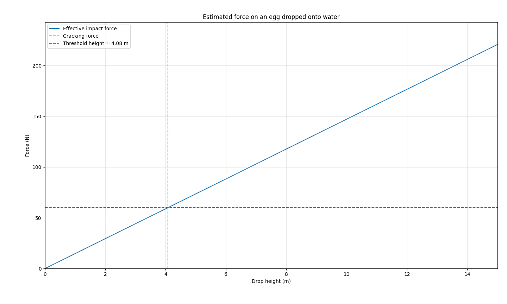

# Can Generative AI solve hard physics problems?

- This is a blog on using GenAI for solving physics problems. 

- For the [egg breaking problem](egg_throw.md), ChatGPT and Gemini made mistakes saying that _eggs will not break if thrown onto water_.

- when probed further using the prompt _would an egg crack if it's thrown from a third-story building onto water?_ here is what ChatGPT answered:

Short answer: **very likely yes, it would crack**.

Here’s why, in a physically grounded way:

### 1. Impact speed from a third story

A third-story height is roughly 8–12 meters. Ignoring air resistance, the egg hits the water at about:
[
v \approx \sqrt{2gh} \approx 12\text{–}15 ,\text{m/s}
]
That’s around 25–35 mph.

### 2. Water behaves “hard” at high speed

Although water feels soft at low speeds, at high impact speeds it behaves much more like a solid surface. This is because:

* The egg has to push water out of the way very quickly
* Water resists rapid deformation (inertia + viscosity effects)

This leads to a large deceleration force over a very short time.

### 3. Eggshell strength is limited

Eggshells are:

* Strong under **uniform compression** (e.g., squeezing evenly)
* Weak under **localized impact or bending stress**

Hitting water at speed creates:

* A sharp pressure spike on one side of the shell
* Uneven stress → cracking

- When might it *not* crack?

It’s possible (but unlikely) if:

* The egg enters **perfectly vertically (tip-first)**
* It hits **very calm water**
* The drop height is on the lower end
* The egg is unusually strong

Even then, it’s a borderline case.

---

- Bottom line

- From a third story, water is effectively “hard enough” that an egg will **almost certainly crack on impact**.

- model the actual **force on the egg vs. shell strength**—it’s a nice compact physics derivation and connects to fluid impact theory.

### Further modelling

- I then gave the following prompt _model the actual force on the egg vs. shell strength_

- This is what ChatGPT answered:

Let us take a typical chicken egg:

* mass (m \approx 0.06\ \text{kg})
* third-story height (h \approx 9\text{–}12\ \text{m})

Ignoring air resistance, the speed on impact is

[
v=\sqrt{2gh}\approx \sqrt{2(9.8)(9\text{–}12)} \approx 13\text{–}15\ \text{m/s}.
]

Now the key issue is: how quickly does the water stop the egg?

If the egg is brought to rest over a distance (d), then the average stopping force is roughly

[
F_{\text{avg}} \approx \frac{mv^2}{2d}.
]

Using (m=0.06\ \text{kg}) and (v \approx 14\ \text{m/s}):

* if (d = 1\ \text{cm} = 0.01\ \text{m}),

[
F_{\text{avg}} \approx \frac{0.06\cdot 14^2}{2(0.01)} \approx 590\ \text{N}
]

* if (d = 2\ \text{cm}),

[
F_{\text{avg}} \approx 295\ \text{N}
]

* if (d = 5\ \text{cm}),

[
F_{\text{avg}} \approx 118\ \text{N}
]

A second estimate comes from drag:

[
F_d \approx \tfrac12 \rho C_d A v^2
]

with water density (\rho \approx 1000\ \text{kg/m}^3), egg cross-sectional area (A \approx 1.5\times 10^{-3}\ \text{m}^2), and (C_d \sim 0.8\text{–}1). That gives

[
F_d \approx 100\text{–}180\ \text{N}
]

right at impact.

For comparison, a chicken egg typically fractures under loads of only **tens of newtons** in ordinary compression, though the exact number depends a lot on orientation and shell defects.

So the comparison is:

* **impact force from a third-story fall onto water:** roughly (100\text{–}600\ \text{N}), depending on how abruptly it stops
* **shell fracture load:** roughly (30\text{–}80\ \text{N}) for a typical egg, order of magnitude

That means the impact force is very plausibly several times larger than the shell can tolerate.

So the physical answer is: **yes, it would very likely crack**.

The important subtlety is that there is no single “actual force” here — the force rises and falls during impact, so what matters is the **peak force** and the **impact duration**, not just one number. The numbers above show why water does not necessarily protect the egg much at that speed.

- Plot of impact height vs. fracture load made using [python script](code/egg_crack_water_plot.py)

### Analysis for sand

Forthcoming

## Mathematics problem(s)

Forthcoming

## Irodov problem(s)

Image analysis (forthcoming)

I asked ChatGPT to solve a problem from the book Irodov (Figure 1).

- [Irodov book](https://dn710308.ca.archive.org/0/items/IrodovProblemsInGeneralPhysics/Irodov-Problems_in_General_Physics.pdf)

- Small ball thrown at an initial velocity vo at an angle $\alpha$ to the horizontal strikes a vertical wall moving towards it at a horizontal velocity v and is bounced to the point from which it was thrown. Determine the time t from the beginning of motion to the moment of impact, neglecting friction losses.

## Solution by ChatGPT

Little projectile + moving-wall.  I will assume:

* the ball is thrown from the origin at (t=0) with (v_0) at angle (\alpha) (so (u_x=v_0\cos\alpha,;u_y=v_0\sin\alpha));
* the vertical acceleration is ( -g);
* the wall is a plane perpendicular to the (x)-axis, initially at (x=D) and moving toward the origin with speed (v) (so wall velocity (=-v));
* the collision is perfectly elastic and instantaneous (no change to vertical component at impact).

Let (t) be the time from launch to impact.  The collision position satisfies
[
x_{\text{ball}}(t)=u_x t,\qquad x_{\text{wall}}(t)=D - v t,
]
so
[
u_x t = D - v t \quad\Rightarrow\quad (u_x+v)t = D. \tag{1}
]

In the wall frame the horizontal velocity of the ball before impact is (u_x+v); an elastic bounce reverses that horizontal component, so transforming back to the lab frame the horizontal velocity immediately after impact is
[
v_x' = -\big(u_x+2v\big).
]
Thus the time from impact until the ball returns to the origin (horizontal condition (x_{\text{collision}}+v_x' t_r=0)) is
[
t_r=\frac{u_x t}{u_x+2v}. \tag{2}
]

Vertical motion is unaffected by the collision.  Let the collision height be
[
y_c = u_y t-\tfrac12 g t^2,
]
and the vertical velocity just after collision (v_{y,c}=u_y-gt).  Requiring the ball to return to (y=0) after time (t_r) gives
[
0 = y_c + v_{y,c}t_r -\tfrac12 g t_r^2.
]
This simplifies (collecting terms) to
[
u_y(t+t_r) - \tfrac12 g (t+t_r)^2 = 0
\quad\Rightarrow\quad t+t_r=\frac{2u_y}{g}. \tag{3}
]

Substitute (t_r) from (2) into (3):
[
t + \frac{u_x t}{u_x+2v} = \frac{2u_y}{g}.
]
Solve for (t).  Noting (1+\dfrac{u_x}{u_x+2v}=\dfrac{2(u_x+v)}{u_x+2v}) we get
[
t\frac{2(u_x+v)}{u_x+2v}=\frac{2u_y}{g}
\quad\Rightarrow\quad
t=\frac{u_y}{g},\frac{u_x+2v}{u_x+v}.
]

Finally substitute (u_x=v_0\cos\alpha,;u_y=v_0\sin\alpha):
[
\boxed{ ; t ;=; \frac{v_0\sin\alpha}{g},\frac{v_0\cos\alpha+2v}{,v_0\cos\alpha+v,};. }
]

(Checks: for (v=0) this gives (t=v_0\sin\alpha/g) — the half flight time as expected; the formula requires (v_0\cos\alpha+v\neq0).)

## Proof by Lean

Unverified

- [Lean file](code/projectile_irodov_figure1.lean)