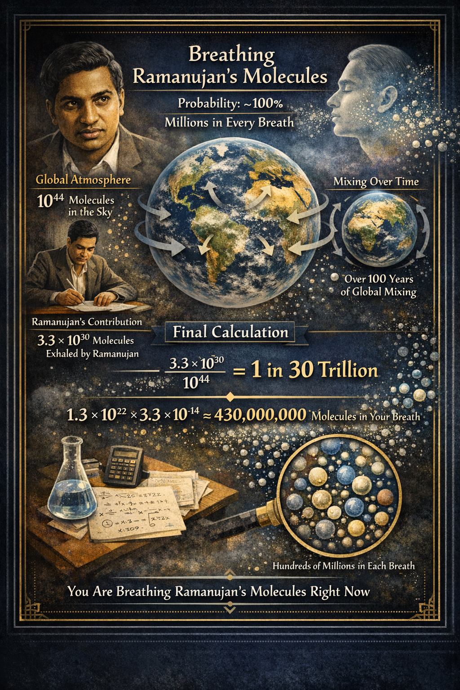
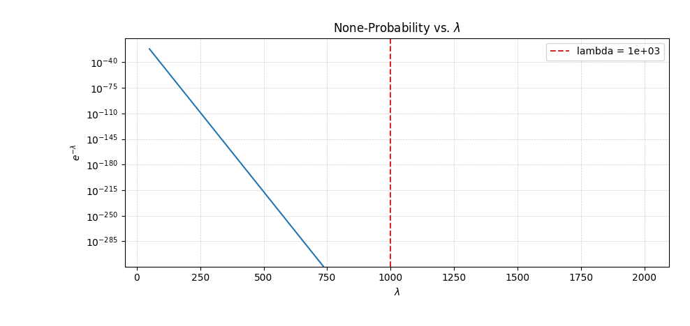

# We are all connected: What is the probability that you have breathed a molecule of air that Ramanujan had breathed?

---

## The Ramanujan Breath Calculation

The answer is surprisingly poetic: the probability is effectively **100%**. In fact, you aren't just breathing one molecule that passed through Ramanujan’s lungs—you are likely breathing millions of them with every single gulp of air.

Here is the breakdown of how the math makes this possible.

### 1. The Global "Bucket" of Air

First, we need to know how many molecules are in the entire atmosphere. The mass of the Earth's atmosphere is approximately **5.15 x 10^18 kg**. Since air is mostly nitrogen and oxygen, its average molar mass is about **29 g/mol**.

* **Total Moles of Air:** approx. 1.8 x 10^20 moles
* **Total Molecules:** Using Avogadro's number (6.022 x 10^23), we get roughly **10^44 molecules** in the sky.

---

### 2. Ramanujan’s Contribution

Srinivasa Ramanujan lived for about 32 years. If we assume an average resting breathing rate of 15 breaths per minute and a tidal volume of 0.5 liters per breath:

* **Breaths in a lifetime:** approx. 250,000,000 breaths.
* **Molecules per breath:** About 1.3 x 10^22 molecules.
* **Total "Ramanujan Molecules":** Over his lifetime, he breathed in and out roughly **3.3 x 10^30 molecules**.

> **Note:** We assume for this calculation that every breath he took contained "fresh" molecules, which is largely true over a lifetime as the atmosphere mixes.

---

### 3. The "Mixing" Factor

For this to work, the air Ramanujan exhaled in Kumbakonam or Cambridge has to be perfectly mixed across the entire globe.

* **Horizontal mixing** (within a hemisphere) takes a few weeks to months.
* **Inter-hemispheric mixing** (between North and South) takes about 1 to 2 years.

Since Ramanujan passed away in 1920, his "shared" molecules have had over a century to spread uniformly. We can safely assume they are evenly distributed.

---

### 4. The Final Calculation

Now, we calculate the "concentration" of Ramanujan molecules in the atmosphere:

**Concentration = Ramanujan Molecules / Total Molecules**
**Concentration = (3.3 x 10^30) / (10^44) = 3.3 x 10^-14**

This means that roughly 1 out of every 30 trillion molecules in the world was once inside Ramanujan. That sounds small, but remember how many molecules are in your next breath (**1.3 x 10^22**).

**Molecules in your breath from Ramanujan:**
(1.3 x 10^22) * (3.3 x 10^-14) = **approx. 430,000,000 molecules.**

### The Statistical Reality

If you expect to find 430 million molecules in every breath, the probability of finding zero is statistically impossible (**P = approx. e^-430,000,000**).

_So, as you read this, you are physically connected to the man who "knew infinity" by hundreds of millions of tiny nitrogen and oxygen messengers_.

---
